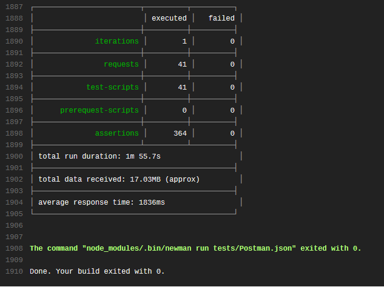
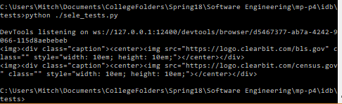

@title[Introduction]
## The Working Men

GitPitch Presentation for CS373
 
See our site at [majorpotential.me](http://majorpotential.me)

---

## Who Are These Jerks?

- Mitchell Traylor (Back End, Testing, Report Author)
- Abel Tesfaye (Back End, Front End)
- Neal Friesenhahn (Back End, Hosting, API)
- Christian Onuogu (Front End)
- Sungsup Lee (Front End)

---

## Demo Time!
[majorpotential.me](http://majorpotential.me)

---

## Testing
- Because Working Men need a Working Site

+++

## Front-End Tests / Mocha

+++

## Back-End Tests / Unittest

+++

## API Tests / Postman

+++

## GUI Tests / Selenium

+++

## Travis-CI
- [For Continuous Integration](https://travis-ci.org/theworkingmen/idb)

---

## What Did We Do Well?

- Everything |
  + (We can elaborate, we're not narcissistic we promise) |
- Coordination |
- Issue Tracking and User Stories |

+++

## Also, Google likes us

+++

## How Could We Improve?

- Working outside our roles |
- Make pages more interesting |
  + Animation, reworked content, etc |
- Make the front-end more beautiful |
- More data to display |

+++

## What Did We Learn From This?

- There are MANY components to big projects like this |
- Planning is ESSENTIAL |
- All the tools |
  + AWS, React, SQLAlchemy, |
  + API Building... |
  + (You get the idea) |

+++

## What Puzzles Us?

- Amazon Lambda |
  + Thankfully we didn't use this |
- Elastic Beanstalk |
  + Adding servers breaks IPs |
- Why our peers dislike GitBook |
  + It worked just fine for us, like any other document editor |

---

## We The SWEople
- See their site at [swethepeople.me](http://swethepeople.me)
- And yes, we all know their names are intentionally confusing

+++

## What Did They Do Well?

- Implementing suggestions |
- Preserving filters (wow!) |
- Lots of information |
- Neatly organized |

+++

## What Could They Do Better?

- Interactive map for districts |
- Their site is open for other new additions |
  + Including senators too |
  + Extended voting history |

+++

## What Did We Learn From Them?

- Front end organizing and design |
- Site animations |
- So many "third" parties |

+++

## What Puzzles Us (About Them)?

- Their Implementation of caching in the front-end |
  + registerServiceWorker.js |
- How they were able to preserve filters on the website |
  + The filters are preserved on different visits to the site |
---

## Visualization
- [Republicans vs Democrats by State](http://majorpotential.me/visualization-pie-chart.html)
- [Entire U.S. Map](http://majorpotential.me/visualization-map.html)

---

## That's All, Folks!
